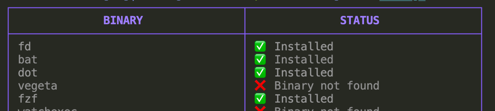

<p align="center">
  
</p>

# KELP
A simple replacement for homebrew for installing binary packages on MacOS written in Go.

## Why?

I built Kelp to scratch my own itch:

* No waiting for a formula to become available on homebrew
* Keep all your computers up to date with a single installation manifest
* Install multiple packages at one time (coming soon...)

## How To Install

Go to the [releases](https://github.com/crhuber/kelp/releases) page. Download the latest release

## Screenshots

`kelp list`


`kelp doctor`




## How Do I Use It?


1. Initialize Kelp

    `kelp init`

2. Add kelp binary path to your PATH

    `export PATH=~/.kelp/bin/:$PATH`

3. Add a new package

    `kelp add ogham/exa`

   To use a specific version other than latest use the `-r` flag. Where `-r` is the github release version

    `kelp add -r 1.0.0 ogham/exa`

4. Install

    `kelp install exa`

    or add `-i` during `kelp add`

    `kelp add -i ogham/exa`

5. Upgrade to a new version manually

    `kelp set -r 1.0.1 exa`
    `kelp install exa`

6. Check for a new version

    `kelp update exa`
    `kelp install exa`
   or
    `kelp update -i exa`

## How Does it Work?

It downloads all github releases packages defined in the config file `~/.kelp/kelp.json` to `~/.kelp/bin`.

### How do I configure the config file path

Either use the --config flag or `KELP_CONFIG` environment variable

```
Flags:
  -c, --config string   path to kelp config file (default "/Users/username/.kelp/kelp.json")
```

### What if the package I want is not on github releases?

Easy. Just add the http(s) link to the binary

ie:

`
kelp add -r https://releases.hashicorp.com/terraform/0.11.13/terraform_0.11.13_darwin_amd64.zip hashicorp/terraform
`


## Troubleshooting

Use inspect to open the cache and bin directories for your package

`kelp inspect`

### Why wasnt my package installed ?

Kelp looks for binaries made for MacOS, if it finds a binary for linux or windows it will skip downloading it.

To see what binaries exist use:

`kelp doctor`

If your binary has a different filename than the name of the Github project, kelp doctor may not find it. To give it a hint you can add the name of the binary to the kelp config

`kelp set -b "jira" jira-cli`

To see whats in your config use:

`kelp ls`

### Does it work for Linux?

Not yet

### What if I'm rate limited by Github Api?

Set a github token environment variable

`export GITHUB_TOKEN="XYZ"`

## Contributing

If you find bugs, please open an issue first. If you have feature requests, I probably will not honor it because this project is being built mostly to suit my personal workflow and preferences.
